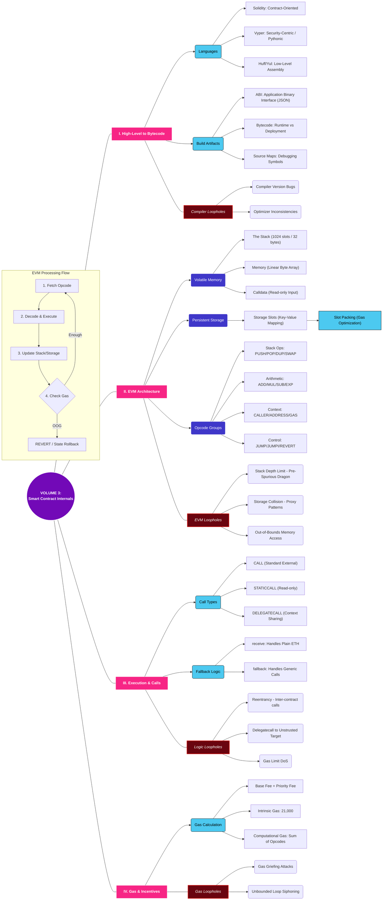
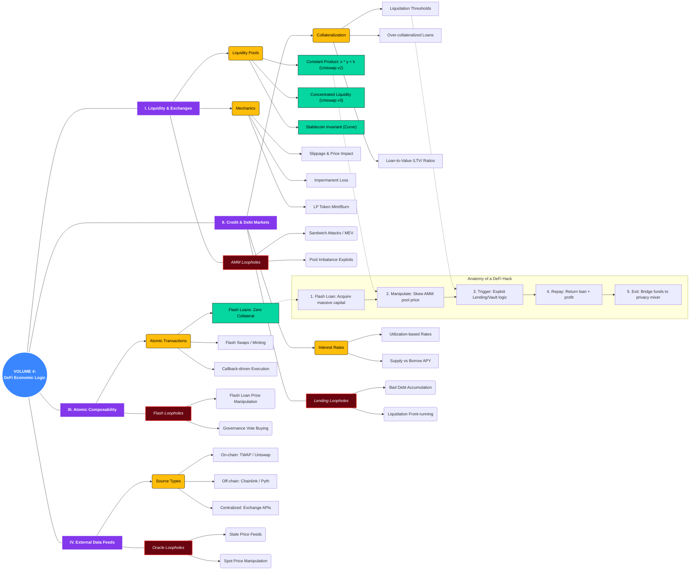
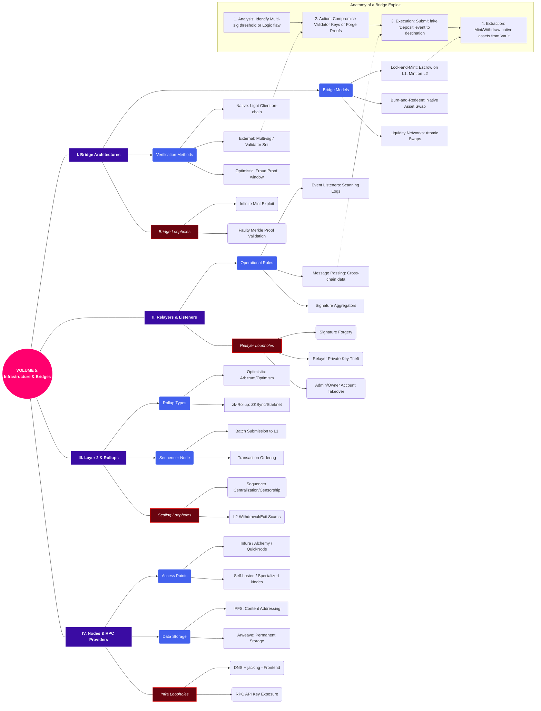
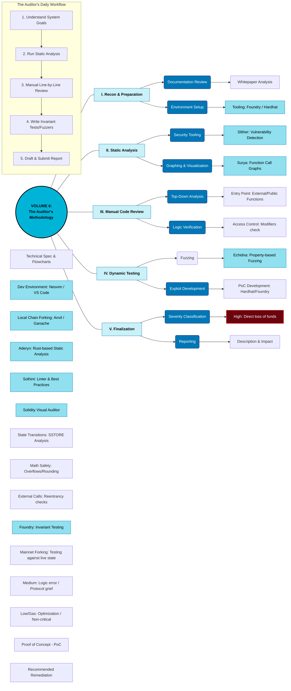
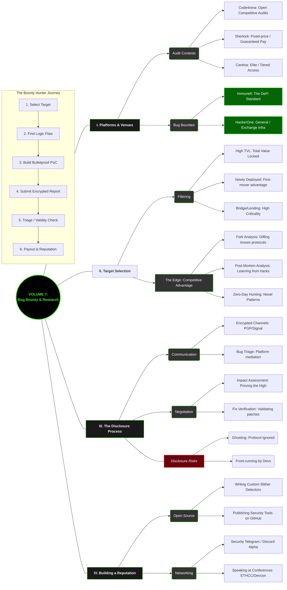

# BlockChainHereICome
Entirely Blockchain.

Volume 1: The Foundation — Protocol Anatomy

Before you can break a system, you must understand its skeleton. Volume 1 focuses on the "First Principles" of blockchain. As a software developer, you need to move beyond seeing the blockchain as a simple database. You must understand it as a P2P network of nodes constantly fighting for consensus.

- Key Focus: How nodes communicate via Gossip protocols, the "Mempool" (the primary playground for front-running), and the finality of transactions.

- The Adversarial Mindset: In this stage, you aren't looking for code bugs; you are looking for network partitions, Eclipse attacks, and ways to disrupt the "Truth" of the ledger.

```mermaid
graph LR
    %% --- Theme & Styles ---
    classDef v1_core fill:#003566,stroke:#ffc300,color:#fff,stroke-width:3px;
    classDef v1_layer fill:#1d3557,stroke:#457b9d,color:#fff,stroke-width:1px;
    classDef v1_comp fill:#2a9d8f,stroke:#264653,color:#fff,stroke-width:1px;
    classDef v1_vuln fill:#6a040f,stroke:#d00000,color:#fff,stroke-width:2px;

    %% --- Central Hub ---
    V1_ROOT((<b>VOLUME 1:<br/>Protocol Fundamentals</b>)):::v1_core

    %% --- BRANCH 1: Node Infrastructure ---
    V1_ROOT --- V1_INFRA[<b>I. Node Anatomy</b>]:::v1_layer
    V1_INFRA --> V1_N_TYPES(Node Classifications):::v1_comp
    V1_N_TYPES --> V1_FN["Full Node: Rule Validator"]
    V1_N_TYPES --> V1_LN["Light Node: Header Only"]
    V1_N_TYPES --> V1_AN["Archive Node: Full History"]
    
    V1_INFRA --> V1_N_COMP(Internal Components):::v1_comp
    V1_N_COMP --> V1_Store[("Database: LevelDB/RocksDB")]
    V1_N_COMP --> V1_EVM["Execution: EVM/WASM"]
    V1_N_COMP --> V1_MP["Mempool: Pending Tx Buffer"]

    %% --- BRANCH 2: P2P Network ---
    V1_ROOT --- V1_P2P[<b>II. P2P & Propagation</b>]:::v1_layer
    V1_P2P --> V1_Disc(Node Discovery):::v1_comp
    V1_Disc --> V1_Boot[Hardcoded Bootnodes]
    V1_Disc --> V1_Kad[Kademlia DHT / Peer Table]

    V1_P2P --> V1_Prop(Gossip Protocol):::v1_comp
    V1_Prop --> V1_Flood[Tx Flooding]
    V1_Prop --> V1_BProp[Block Propagation]
    
    V1_P2P --- V1_V_NET[<i>P2P Loopholes</i>]:::v1_vuln
    V1_V_NET --> V1_Sybil(Sybil Attacks)
    V1_V_NET --> V1_Eclipse(Eclipse Attacks)
    V1_V_NET --> V1_DoS(Network-level DDoS)

    %% --- BRANCH 3: The Data Layer ---
    V1_ROOT --- V1_DATA[<b>III. The Data Layer</b>]:::v1_layer
    V1_DATA --> V1_Head(Block Header):::v1_comp
    V1_Head --> V1_PHash[Prev Block Hash]
    V1_Head --> V1_Merk[Merkle Root]
    V1_Head --> V1_Nonce[Nonce / Timestamp]

    V1_DATA --> V1_Model(Transaction Models):::v1_comp
    V1_Model --> V1_UTXO["UTXO: Bitcoin Style"]
    V1_Model --> V1_Acc["Account: Ethereum Style"]
    
    V1_DATA --- V1_V_DATA[<i>Data Loopholes</i>]:::v1_vuln
    V1_V_DATA --> V1_Mall(Signature Malleability)
    V1_V_DATA --> V1_Rep(Transaction Replay)

    %% --- BRANCH 4: Consensus ---
    V1_ROOT --- V1_CONS[<b>IV. Consensus Mechanics</b>]:::v1_layer
    V1_CONS --> V1_Mech(Algorithms):::v1_comp
    V1_Mech --> V1_PoW[Proof of Work]
    V1_Mech --> V1_PoS[Proof of Stake]
    V1_Mech --> V1_BFT["BFT / Voting"]

    V1_CONS --> V1_Final(Finality):::v1_comp
    V1_Final --> V1_Prob[Probabilistic]
    V1_Final --> V1_Det[Deterministic]

    V1_CONS --- V1_V_CONS[<i>Consensus Loopholes</i>]:::v1_vuln
    V1_V_CONS --> V1_51(51% Attack)
    V1_V_CONS --> V1_Self(Selfish Mining)
    V1_V_CONS --> V1_Long(Long Range Attacks)

    %% --- Transaction Lifecycle ---
    subgraph V1_Journey [Transaction Lifecycle]
        V1_T1[1. Signing] --> V1_T2[2. Broadcast]
        V1_T2 --> V1_T3[3. Validation]
        V1_T3 --> V1_T4[4. Mempool]
        V1_T4 --> V1_T5[5. Inclusion]
        V1_T5 --> V1_T6[6. Confirmation]
    end

    %% Strategic Links for Flow
    V1_T2 -.-> V1_P2P
    V1_T4 -.-> V1_MP
    V1_T5 -.-> V1_CONS```
Volume 2: The Cryptographic Vault — Keys & Identity

In Web3, "Identity" is math. Volume 2 dives into the cryptographic primitives that secure every dollar on-chain. This isn't just about knowing what a private key is; it's about understanding how entropy (randomness) becomes a seed phrase, and how that seed is mathematically derived into thousands of addresses.

- Key Focus: Elliptic Curve Cryptography (secp256k1), the ECDSA signing process, and the vulnerability of nonces.

- The Adversarial Mindset: You are looking for weak randomness in key generation and "Replay Attacks" where a valid signature on one chain is reused to steal funds on another.

```mermaid
graph LR
    %% --- Theme & Styles (V2 Specific) ---
    classDef v2_core fill:#ff8c00,stroke:#000,color:#000,stroke-width:3px;
    classDef v2_layer fill:#fefae0,stroke:#dda15e,color:#000,stroke-width:1px;
    classDef v2_comp fill:#a8dadc,stroke:#457b9d,color:#000,stroke-width:1px;
    classDef v2_math fill:#457b9d,stroke:#1d3557,color:#fff,stroke-width:1px;
    classDef v2_vuln fill:#6a040f,stroke:#d00000,color:#fff,stroke-width:2px;

    %% --- Central Hub ---
    V2_ROOT((<b>VOLUME 2:<br/>The Cryptographic Vault</b>)):::v2_core

    %% --- BRANCH 1: Primitives & Math ---
    V2_ROOT --- V2_MATH[<b>I. Cryptographic Primitives</b>]:::v2_layer
    V2_MATH --> V2_Hash(Hashing Functions):::v2_comp
    V2_Hash --> V2_H1["Keccak-256 (EVM)"]:::v2_math
    V2_Hash --> V2_H2["SHA-256 (Bitcoin)"]:::v2_math
    V2_Hash --> V2_H3["RIPEMD-160 (Addresses)"]:::v2_math
    
    V2_MATH --> V2_Ecc(Elliptic Curve Cryptography):::v2_comp
    V2_Ecc --> V2_E1["Curve secp256k1 (Bitcoin/EVM)"]:::v2_math
    V2_Ecc --> V2_E2["Curve Ed25519 (Solana/Near)"]:::v2_math
    V2_Ecc --> V2_E3["Field Math: Modular Arithmetic"]:::v2_math
    V2_Ecc --> V2_E4["Scalar Multiplication / Point Addition"]:::v2_math

    V2_MATH --> V2_Sym(Symmetric Encryption):::v2_comp
    V2_Sym --> V2_AES["AES-256 (Keystore Encryption)"]:::v2_math

    V2_MATH --- V2_V_MATH[<i>Primitive Loopholes</i>]:::v2_vuln
    V2_V_MATH --> V2_M_Col(Hash Collisions)
    V2_V_MATH --> V2_M_Quan(Quantum Weakness)
    V2_V_MATH --> V2_M_Imp(Implementation Errors)

    %% --- BRANCH 2: Key Management Lifecycle ---
    V2_ROOT --- V2_KEYS[<b>II. Key & Identity Lifecycle</b>]:::v2_layer
    V2_KEYS --> V2_Gen(Generation Phase):::v2_comp
    V2_Gen --> V2_G1["Entropy Source: PRNG/HRNG"]:::v2_math
    V2_Gen --> V2_G2["BIP-39 Mnemonic / Seed Phrase"]
    V2_Gen --> V2_G3["BIP-32/44 HD Wallet Derivation"]:::v2_math

    V2_KEYS --> V2_Deriv(Derivation Path):::v2_comp
    V2_Deriv --> V2_D1[Master Private Key]
    V2_D1 --> V2_D2[Child Private Key]
    V2_D2 --> V2_D3["Public Key (Point G)"]:::v2_math
    V2_D3 --> V2_D4["Wallet Address (Keccak/RIPEMD)"]:::v2_math

    V2_KEYS --> V2_Storage(Storage Phase):::v2_comp
    V2_Storage --> V2_S1[Cold Storage - Air-gapped]
    V2_Storage --> V2_S2["Hardware Security Module (HSM)"]
    V2_Storage --> V2_S3[Hot Wallet - Software]
    V2_Storage --> V2_S4["Multi-Party Computation (MPC)"]
    
    V2_KEYS --- V2_V_KEYS[<i>Key Management Loopholes</i>]:::v2_vuln
    V2_V_KEYS --> V2_K_Ent(Weak Entropy Source)
    V2_V_KEYS --> V2_K_Path(Path Derivation Exploit)
    V2_V_KEYS --> V2_K_Clip(Clipboard Keyloggers)

    %% --- BRANCH 3: Transaction Signing (ECDSA) ---
    V2_ROOT --- V2_ECDSA[<b>III. Transaction Signing</b>]:::v2_layer
    V2_ECDSA --> V2_Sign(Signing Process):::v2_comp
    V2_Sign --> V2_Si1["Tx Payload / Message (m)"]
    V2_Sign --> V2_Si2["Hashing: H(m)"]:::v2_math
    V2_Sign --> V2_Si3["Generate Ephemeral Key (k)"]
    V2_Si4["Signature Components (r, s)"]:::v2_math
    V2_Si2 & V2_Si3 --> V2_Si4
    V2_Si4 --> V2_Si5["Broadcast Tx {m, r, s, PubKey}"]

    V2_ECDSA --> V2_Verif(Verification Process):::v2_comp
    V2_Verif --> V2_V1["Receive Tx Payload & Sig"]
    V2_V2["Reconstruct PubKey"]:::v2_math
    V2_Verif --> V2_V3["Check Verification Equation"]:::v2_math
    V2_V1 --> V2_V2
    V2_V2 --> V2_V3

    V2_ECDSA --- V2_V_ECDSA[<i>Signing Loopholes</i>]:::v2_vuln
    V2_V_ECDSA --> V2_E_Nonce(Nonce k Reuse Attack)
    V2_V_ECDSA --> V2_E_Rep(Replay - Lack of ChainID)
    V2_V_ECDSA --> V2_E_Mall(Signature Malleability)

    %% --- BRANCH 4: Advanced Concepts ---
    V2_ROOT --- V2_ADV[<b>IV. Advanced Cryptography</b>]:::v2_layer
    V2_ADV --> V2_Zkp(Zero-Knowledge Proofs):::v2_comp
    V2_Zkp --> V2_Z1[zk-SNARKs]
    V2_Zkp --> V2_Z2[zk-STARKs]
    
    V2_ADV --> V2_MpcA(MPC & TSS):::v2_comp
    V2_MpcA --> V2_M1[Threshold Signatures]
    V2_MpcA --> V2_M2[Key Sharding]

    V2_ADV --- V2_V_ADV[<i>Advanced Loopholes</i>]:::v2_vuln
    V2_V_ADV --> V2_A_ZkpF(ZKP Soundness Error)
    V2_V_ADV --> V2_A_Coll(Participant Collusion)
```
Volume 3: Smart Contract Internals — The EVM Engine Room

This is where your software engineering skills meet the "World Computer." Volume 3 explores the Ethereum Virtual Machine (EVM) at the opcode level. To be a top-tier auditor, you must understand the difference between Stack, Memory, and Storage.

- Key Focus: Solidity compilation, the cost of Opcodes (Gas), and the dangerous power of DELEGATECALL.

- The Adversarial Mindset: You are hunting for "Storage Collisions"—where one variable accidentally overwrites another in memory—and logic flaws that allow unauthorized access to sensitive administrative functions.


Volume 4: DeFi Economic Logic — Financial Engineering

Volume 4 marks the transition from "Technical Hacking" to "Economic Hacking." In DeFi, the code might be perfect, but the math might be flawed. This chapter covers how decentralized exchanges (DEXs) price assets and how lending protocols manage risk.

- Key Focus: Automated Market Makers (AMMs), Price Oracles, and the "Flash Loan"—a tool that allows you to borrow millions of dollars with zero collateral for a single transaction.

- The Adversarial Mindset: You are looking for ways to manipulate an Oracle's price feed to make a protocol think an asset is worth more (or less) than it is, allowing you to drain its liquidity.


Volume 5: Infrastructure & Bridge Web — High-Value Targets

Bridges are the "Interstate Highways" of crypto, and they are the most attacked infrastructure in history. Volume 5 focuses on how assets move between chains (Cross-chain) and the off-chain components (Relayers) that facilitate these moves.

- Key Focus: Lock-and-mint mechanics, Validator multi-sig security, and Layer 2 (Rollup) sequencers.

- The Adversarial Mindset: You are targeting the "off-chain" weak points—phishing validator keys, compromising DNS to hijack frontends, or finding flaws in the cryptographic proofs that bridges rely on to verify cross-chain deposits.


Volume 6: The Auditor’s Methodology — The Professional SOP

Knowledge is useless without a process. Volume 6 outlines the industry-standard "Standard Operating Procedure" (SOP) used by professional security firms. This is the workflow you will follow to ensure no line of code goes unvetted.

- Key Focus: Static Analysis (using Slither/Aderyn), Fuzzing (testing with random data), and Manual Code Review.

- The Adversarial Mindset: This is about discipline. You move from the "macro" (how the project works) to the "micro" (line-by-line review) to find the bugs that automated tools miss.


Volume 7: Bug Bounties & Research — The Hacker’s Marketplace

The final volume is your roadmap to professional success. It covers the ecosystem of competitive auditing and bug bounties. This is where you learn to write reports that get paid and how to build a reputation that gets you hired by the top protocols in the world.

- Key Focus: Audit contests (Code4rena/Sherlock), Bug Bounty platforms (Immunefi), and the legal/ethical disclosure process.

- The Adversarial Mindset: You are now a professional researcher. Your goal is to find "Zero-Day" vulnerabilities and communicate them securely to developers before the "black-hat" hackers find them.


